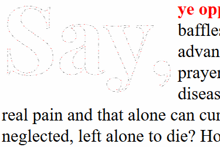

OneWindyNight
=============

OneWindyNight (*OWN*) is a tool for selectively replacing pieces of text in a web page with "spiffed-up" text in either `SVG` or `CANVAS` elements.

The [OneWindyNight home page](http://eatdirtshit.rocks/feats/OneWindyNight/index.html) is chock full of demos!

Features
========
Implementing animated _drop caps_ and _pull quotes_ was the original use case. Right now, one animated-text handler, which manipulates an [SVG](https://developer.mozilla.org/en-US/docs/Web/SVG) representation of the target text via [CSS animation](https://developer.mozilla.org/en-US/docs/Web/CSS/CSS_Animations/Using_CSS_animations), is built in. Here's what it looks like:

How to use *OWN* now
====================
1. Get `opentype.js` or `opentype.min.js` file from the [opentype.js project's `master.zip` file](https://github.com/nodebox/opentype.js/archive/master.zip).
2. Select a TrueType and OpenType font with a friendly license. I've used [Claus Eggers Sørensen's lovely PlayfairDisplay-Bold.ttf](https://github.com/clauseggers/Playfair-Display) for the *OWN* demo page.
3. Get `OneWindyNight.js` from [the *OWN* `master.zip` file](https://github.com/briandonovan/OneWindyNight/archive/master.zip).
4. View-source of the [*OWN* demo page](http://eatdirtshit.rocks/feats/OneWindyNight/index.html) to see how it's used.

Roadmap
=======
1. Add more animated-text handlers.
2. Make adding new animated-text handlers more straightforward.

Thanks!
=======
I'm grateful to everyone whose hard work made writing *OneWindyNight* feasible, particularly to the authors of the awesome [opentype.js](https://github.com/nodebox/opentype.js) project and to typeface creators like [Claus Eggers Sørensen](https://github.com/clauseggers) who have made their work available for creative reuse!

Thanks also go out to Cockos Incorporated, the creators of [LICEcap](http://www.cockos.com/licecap/), the free and excellent tool which I used to record the animation sample shown above.
